# SI KOST – Sistem Informasi Kost


Sistem Informasi Kost (SI Kost) adalah aplikasi web berbasis Laravel yang digunakan untuk mengelola proses pemesanan dan pengelolaan kamar kost. Aplikasi ini menyediakan fitur untuk pendaftaran pengguna, pemesanan kost, pengecekan status, hingga manajemen data kamar oleh admin. Sistem ini dirancang untuk memberikan pengalaman pemesanan kost yang mudah, cepat, transparan, dan terstruktur.

---

## Daftar Isi

- [SI KOST – Sistem Informasi Kost](#si-kost--sistem-informasi-kost)
  - [Daftar Isi](#daftar-isi)
  - [Fitur Utama](#fitur-utama)
    - [Manajemen Kamar Kost](#manajemen-kamar-kost)
    - [Manajemen Admin](#manajemen-admin)
    - [Fitur Sistem](#fitur-sistem)
  - [Tech Stack](#tech-stack)
  - [**🖥 Backend**](#-backend)
  - [**🎨 Frontend**](#-frontend)
  - [**📦 Libraries (Composer \& NPM)**](#-libraries-composer--npm)
    - [**Composer (PHP)**](#composer-php)
    - [**NPM (Frontend)**](#npm-frontend)
  - [**🗄 Database**](#-database)
  - [**⚙️ System Requirements**](#️-system-requirements)
    - [Server](#server)
    - [PHP Extensions](#php-extensions)
  - [Instalasi](#instalasi)
  - [**1. Clone Repository**](#1-clone-repository)
  - [**2. Install Dependencies**](#2-install-dependencies)
    - [**Backend – Composer**](#backend--composer)
    - [**Frontend – Node Modules**](#frontend--node-modules)
  - [**3. Setup Environment (.env)**](#3-setup-environment-env)
  - [**4. Konfigurasi Database (MySQL)**](#4-konfigurasi-database-mysql)
  - [**5. Migrasi Database**](#5-migrasi-database)
  - [**6. Konfigurasi Supabase (Storage Gambar)**](#6-konfigurasi-supabase-storage-gambar)
  - [**7. Setup Storage Laravel**](#7-setup-storage-laravel)
  - [**8. Build Asset (Vite)**](#8-build-asset-vite)
    - [Mode Development:](#mode-development)
    - [Mode Production:](#mode-production)
  - [**9. Menjalankan Aplikasi**](#9-menjalankan-aplikasi)
- [⚙️ **Konfigurasi Tambahan**](#️-konfigurasi-tambahan)
  - [**Email Configuration**](#email-configuration)
  - [Role \& Permissions](#role--permissions)
  - [Fitur Berdasarkan Role](#fitur-berdasarkan-role)
    - [User](#user)
    - [Admin](#admin)
  - [Screenshot](#screenshot)
    - [**1. Halaman Beranda (Hero Section)**](#1-halaman-beranda-hero-section)
    - [**2. Fitur Booking**](#2-fitur-booking)
    - [**3. Testimonial**](#3-testimonial)
    - [**4. Tentang KOST-SI**](#4-tentang-kost-si)
    - [**5. Halaman Kontak**](#5-halaman-kontak)
    - [**6. Halaman Register**](#6-halaman-register)
    - [**7. Halaman Login**](#7-halaman-login)
    - [**8. Daftar Kamar Kos**](#8-daftar-kamar-kos)
    - [**9. Detail Kamar**](#9-detail-kamar)
    - [**10. Booking Kamar**](#10-booking-kamar)
    - [**11. Halaman Beranda (User Login)**](#11-halaman-beranda-user-login)
    - [**12. Halaman Pesanan Saya**](#12-halaman-pesanan-saya)
    - [**13. Dashboard Admin**](#13-dashboard-admin)
    - [**14. Dashboard Admin – Booking Terbaru**](#14-dashboard-admin--booking-terbaru)
    - [**15. Kelola Pemesanan**](#15-kelola-pemesanan)
    - [**16. Kelola Kamar**](#16-kelola-kamar)
    - [**17. Tambah Kamar – Form Bagian 1**](#17-tambah-kamar--form-bagian-1)
    - [**18. Tambah Kamar – Form Bagian 2**](#18-tambah-kamar--form-bagian-2)
    - [**19. Activity Log**](#19-activity-log)
    - [**20. Detail Aktivitas**](#20-detail-aktivitas)
  - [Struktur Database](#struktur-database)
    - [**Tabel Utama**](#tabel-utama)
    - [**Relasi Database**](#relasi-database)
- [⚙️ Arsitektur \& Komponen](#️-arsitektur--komponen)
    - [**Arsitektur Aplikasi**](#arsitektur-aplikasi)
- [✨ Fitur Teknis Utama](#-fitur-teknis-utama)
- [🧪 Testing](#-testing)
- [🚀 Penggunaan](#-penggunaan)
    - [**Login Pertama Kali**](#login-pertama-kali)
    - [**Alur Penggunaan Sistem**](#alur-penggunaan-sistem)
- [🛠 Deployment](#-deployment)
    - [**Kebutuhan Server**](#kebutuhan-server)
    - [**Optimasi Production**](#optimasi-production)
- [🤝 Kontribusi](#-kontribusi)
- [📄 Lisensi](#-lisensi)
- [❤️ Credits](#️-credits)

---

## Fitur Utama

### Manajemen Kamar Kost  
- ✅ **List Kamar Kost** – Pengguna dapat melihat daftar kamar kost lengkap dengan detail dan statusnya  
- ✅ **Detail Kamar** – Informasi lengkap kamar (foto, fasilitas, harga, lokasi, status)  
- ✅ **Pemesanan Kamar (Booking)** – Pengguna dapat melakukan booking langsung dari website  
- ✅ **Status Pemesanan** – Pengguna dapat melihat apakah pemesanan mereka *pending*, *diterima*, atau *ditolak*  

### Manajemen Admin  
- ✅ **CRUD Kamar Kost** – Admin dapat menambah, memperbarui, dan menghapus kamar  
- ✅ **Upload Foto Kamar** – Admin dapat mengelola gambar kamar  
- ✅ **Dashboard Admin** – Menampilkan statistik kamar dan pemesanan  
- ✅ **Validasi Pemesanan** – Admin dapat menerima atau menolak booking pengguna  
- ✅ **Activity Log** – Melacak aktivitas pengguna dan admin dalam sistem  

### Fitur Sistem  
- ✅ **Authentication** – Login & registrasi untuk user dan admin  

---

## Tech Stack

## **🖥 Backend**

* Laravel 10+
* PHP 8.2
* Blade Template Engine
* Eloquent ORM
* Custom Activity Logger (manual, bukan package)
* Supabase Storage Integration (custom service via Guzzle)
* Laravel Routing (web.php, admin.php)

---

## **🎨 Frontend**

* **Tailwind CSS**
* **Vite** (build CSS/JS)
* **Bootstrap JavaScript** (bukan Bootstrap CSS)
* **Vanilla JavaScript**
* **Blade Components**

---

## **📦 Libraries (Composer & NPM)**

### **Composer (PHP)**

* **GuzzleHTTP** – untuk Supabase
* **Symfony Components** – bawaan Laravel
* **Carbon** – date handling
* **PHPUnit** – testing default Laravel

### **NPM (Frontend)**

* TailwindCSS
* PostCSS
* Autoprefixer
* Vite

---

## **🗄 Database**

* MySQL

---

## **⚙️ System Requirements**

### Server

* **PHP ≥ 8.2**
* **MySQL ≥ 5.7**
* **Composer**
* **Node.js ≥ 18**
* **npm**
* **Apache / Nginx**

### PHP Extensions

* OpenSSL
* PDO
* Mbstring
* Tokenizer
* XML
* JSON
* BCMath
* Ctype
* Fileinfo
* GD *(jika gambar perlu diolah)*
  
---

## Instalasi

## **1. Clone Repository**

```bash
git clone https://github.com/aidilsaputrakirsan-classroom/final-project-cloud-computing-b-cc-kelompok-3-alltoowell.git
cd final-project-cloud-computing-b-cc-kelompok-3-alltoowell
```
---

## **2. Install Dependencies**

### **Backend – Composer**

```bash
composer install
```

### **Frontend – Node Modules**

```bash
npm install
```

---

## **3. Setup Environment (.env)**

Salin file `.env`:

```bash
cp .env.example .env
```

Generate application key:

```bash
php artisan key:generate
```

---

## **4. Konfigurasi Database (MySQL)**

Ubah pengaturan berikut di file `.env` sesuai database:

```env
APP_NAME=SI-KOST
APP_ENV=local
APP_KEY=base64:Bzu5zJp0d4llWCSGe24g+s4JZ0I0Ydhrg5HMABz2Otg=
APP_DEBUG=true
APP_URL=http://127.0.0.1:8000
SUPABASE_URL=https://eezmxiakwegbdmgrgdus.supabase.co
SUPABASE_KEY=
```

---

## **5. Migrasi Database**


```bash
php artisan migrate
```

---

## **6. Konfigurasi Supabase (Storage Gambar)**

Tambahkan di `.env`:

```env
SUPABASE_URL=your-supabase-url
SUPABASE_KEY=your-supabase-api-key
```

> ⚠ **Jangan upload .env ke GitHub!**
> Supabase key harus aman.

---

## **7. Setup Storage Laravel**

Untuk menampilkan gambar local (jika ada):

```bash
php artisan storage:link
```

---

## **8. Build Asset (Vite)**

### Mode Development:

```bash
npm run dev
```

### Mode Production:

```bash
npm run build
```

---

## **9. Menjalankan Aplikasi**

Start server Laravel:

```bash
php artisan serve
```

Akses aplikasi melalui:

```
http://127.0.0.1:8000
```

---

# ⚙️ **Konfigurasi Tambahan**

## **Email Configuration**

Dipakai untuk logging email:

```env
MAIL_MAILER=log
QUEUE_CONNECTION=sync
SESSION_DRIVER=file
SESSION_LIFETIME=120
```

---

## Role & Permissions

| Role | Deskripsi |
|------|-----------|
| **User** | Melakukan pemesanan kamar kost |
| **Admin** | Mengelola data kamar & booking |

---

## Fitur Berdasarkan Role

### User  
- 📝 Registrasi & Login  
- 🏠 Home setelah login  
- 🏘 Melihat daftar kamar kost  
- 🔍 Melihat detail kamar  
- 🛏 Melakukan booking kamar  
- 📋 Melihat status pemesanan  

### Admin  
- 🔑 Login Admin  
- 📊 Dashboard Admin  
- ➕ Tambah kamar baru  
- ✏ Edit kamar  
- ❌ Hapus kamar  
- 🖼 Upload foto kamar  
- 🔄 Ubah status kamar (Available / Booked)  
- 📄 Memproses booking pengguna  
- 📜 Activity log  

---

## Screenshot  

### **1. Halaman Beranda (Hero Section)**


Halaman ini merupakan tampilan utama ketika pengguna pertama kali mengakses website KOST-SI. Bagian hero didesain untuk memberikan kesan profesional dan informatif melalui slogan besar yang menjelaskan fungsi utama platform. Pengguna langsung disuguhkan tombol *Call to Action* untuk melihat daftar kamar, serta rangkuman statistik seperti jumlah kamar tersedia, total pengguna mahasiswa, rating platform, dan layanan pendukung lainnya. Tujuan halaman ini adalah memastikan pengguna memahami manfaat platform sejak pertama kali berkunjung.

---

### **2. Fitur Booking**

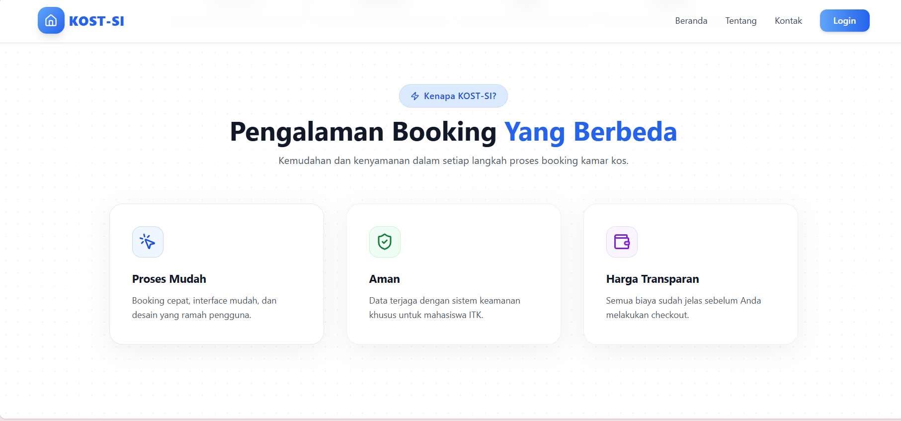
Halaman ini menjelaskan fitur unggulan KOST-SI yang menjadi alasan utama platform ini dibuat untuk mahasiswa ITK. Tiga fitur inti yang ditampilkan meliputi kemudahan proses booking melalui antarmuka yang sederhana, keamanan data pengguna yang dijaga ketat, serta harga transparan tanpa biaya tersembunyi. Bagian ini dirancang untuk memberikan pemahaman menyeluruh tentang keunggulan aplikasi dan menumbuhkan rasa percaya calon pengguna sebelum mereka melanjutkan ke proses berikutnya.

---

### **3. Testimonial**

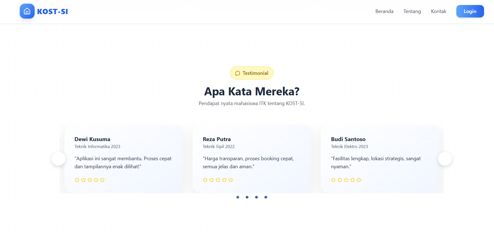
Bagian testimonial menampilkan pengalaman nyata mahasiswa ITK yang telah menggunakan layanan KOST-SI. Setiap testimonial memuat nama mahasiswa, asal jurusan, komentar mengenai kualitas platform, serta rating yang diberikan. Struktur slider memudahkan pengguna melihat beberapa ulasan secara teratur tanpa memenuhi seluruh halaman. Tujuannya adalah memperkuat citra positif platform dan memberikan bukti sosial bahwa aplikasi ini memang membantu mahasiswa menemukan kamar kos dengan lebih mudah.

---

### **4. Tentang KOST-SI**

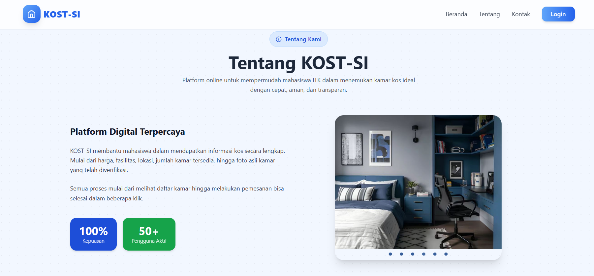
Halaman ini menjelaskan latar belakang dan motivasi dibuatnya platform KOST-SI sebagai solusi digital untuk pencarian kamar kos khusus mahasiswa ITK. Pada bagian ini, pengguna dapat membaca penjelasan singkat mengenai misi platform, kemudahan yang ditawarkan, serta manfaat yang dapat diperoleh mahasiswa. Dilengkapi dengan slider foto kamar berkualitas untuk memberikan gambaran visual nyata mengenai jenis kamar yang dapat ditemukan melalui platform.

---

### **5. Halaman Kontak**


Halaman kontak memberikan informasi kepada pengguna mengenai cara menghubungi tim admin atau pengelola platform. Informasi yang ditampilkan terdiri dari nomor telepon, alamat email, serta lokasi kampus ITK Balikpapan sebagai pusat layanan akademik dan perumahan mahasiswa. Bagian ini berfungsi memastikan pengguna dapat memperoleh bantuan ketika menghadapi kendala atau membutuhkan informasi tambahan terkait pemesanan kamar atau penggunaan platform.

---

### **6. Halaman Register**

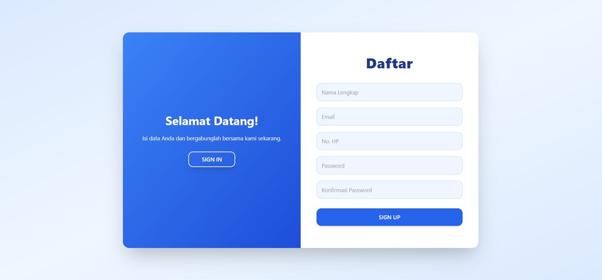
Form registrasi pengguna baru ditampilkan dengan desain sederhana dan modern untuk memastikan pengalaman pendaftaran yang nyaman dan mudah dipahami. Pengguna diminta mengisi data penting seperti nama lengkap, email aktif, nomor telepon, password, dan konfirmasi password. Layout halaman dibuat dua kolom agar proses pengisian terasa lebih profesional dan efisien. Halaman ini menjadi pintu awal bagi pengguna untuk dapat mengakses seluruh fitur yang tersedia dalam platform.

---

### **7. Halaman Login**

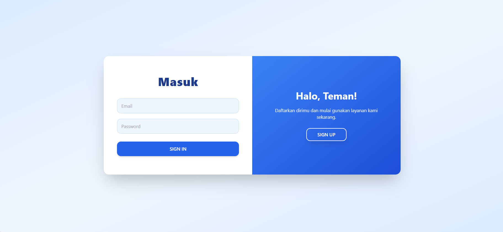
Halaman login merupakan titik autentikasi bagi pengguna yang ingin mengakses akunnya. Pada halaman ini pengguna memasukkan email dan password yang telah terdaftar. Desainnya dibuat minimalis agar pengguna dapat fokus pada proses login. Terdapat pula tautan menuju halaman pendaftaran bagi pengguna baru yang belum memiliki akun.

---

### **8. Daftar Kamar Kos**

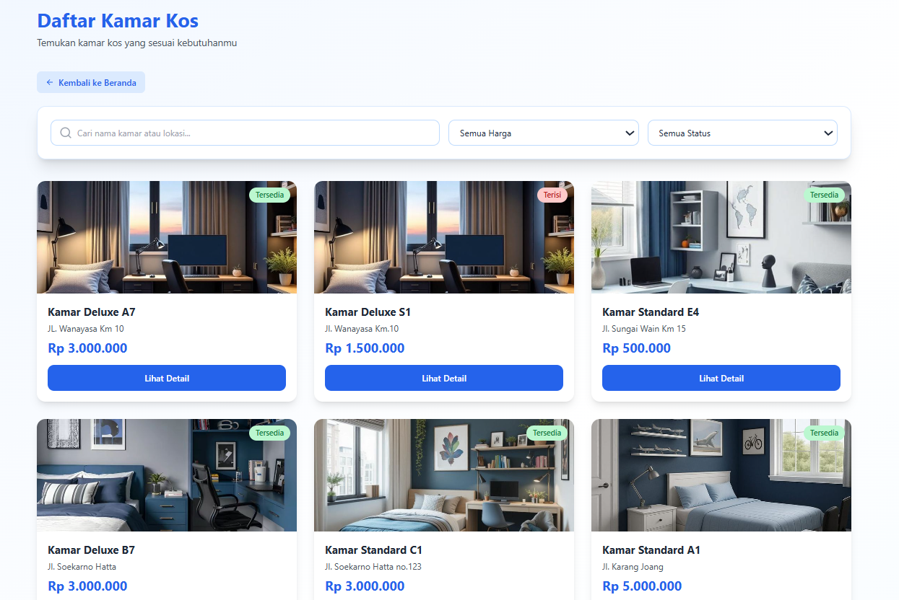
Halaman ini menampilkan seluruh kamar kos yang tersedia maupun yang telah terisi. Pengguna dapat melakukan pencarian kamar berdasarkan filter seperti harga dan status ketersediaan. Setiap kartu kamar berisi foto kamar, alamat, harga, status tersedia atau tidak, serta tombol untuk melihat detail kamar lebih lanjut. Tujuan halaman ini adalah mempermudah pengguna menelusuri pilihan kamar secara cepat dan efisien.

---

### **9. Detail Kamar**

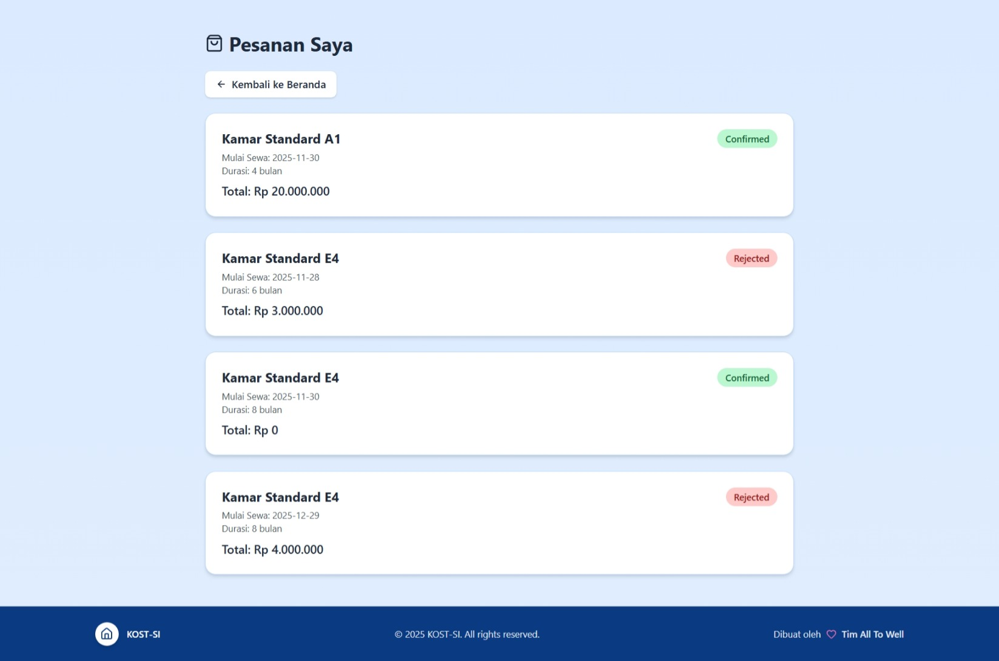
Halaman detail kamar menampilkan informasi lengkap mengenai sebuah kamar kos, termasuk foto besar kamar, nama kamar, harga per bulan, fasilitas, lokasi, dan peta area sekitar. Bagian ini menawarkan gambaran menyeluruh kepada pengguna sebelum melakukan pemesanan, serta menyediakan tombol *Pesan Sekarang* jika pengguna tertarik untuk melanjutkan ke proses booking. Detail yang lengkap sangat membantu pengguna membuat keputusan dengan lebih yakin.

---

### **10. Booking Kamar**

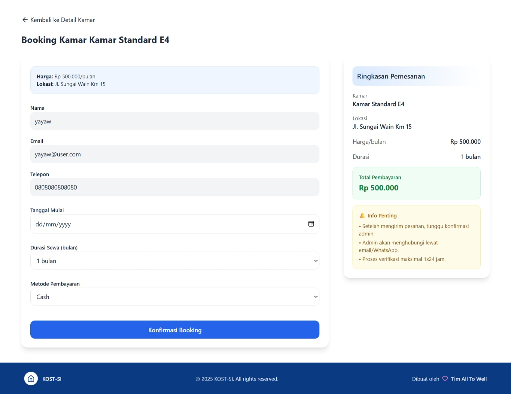
Halaman ini menyediakan form lengkap bagi pengguna untuk melakukan pemesanan kamar. Pengguna diminta mengisi data seperti nama, kontak, tanggal mulai sewa, durasi sewa, dan metode pembayaran. Di sisi kanan halaman terdapat ringkasan pemesanan yang mencakup total biaya, informasi verifikasi admin, serta syarat dan ketentuan pemesanan. Halaman ini dirancang untuk memastikan seluruh informasi pemesanan disampaikan dengan jelas sebelum pengguna melakukan konfirmasi akhir.

---

### **11. Halaman Beranda (User Login)**

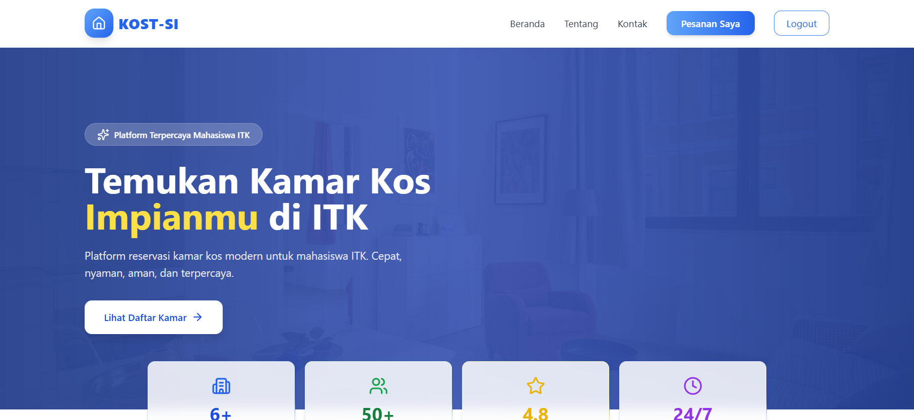
Setelah pengguna berhasil login, tampilan beranda berubah menyesuaikan status pengguna. Navigasi bar kini menampilkan menu khusus seperti *Pesanan Saya* dan tombol logout, menandakan bahwa pengguna telah terautentikasi. Meskipun tampilannya mirip dengan halaman beranda utama, bagian ini telah menyesuaikan kebutuhan pengguna terdaftar agar mereka dapat mengakses fitur dengan lebih cepat dan personal.

---

### **12. Halaman Pesanan Saya**


Halaman ini berfungsi sebagai pusat informasi bagi pengguna untuk memantau seluruh pemesanan yang pernah dilakukan. Setiap kartu pesanan menampilkan detail seperti nama kamar, tanggal mulai sewa, durasi, total pembayaran, serta status pemesanan. Status ini dapat berupa *Pending*, *Confirmed*, atau *Rejected*. Halaman ini memberikan kejelasan kepada pengguna mengenai perkembangan setiap pemesanan mereka.

---

### **13. Dashboard Admin**


Dashboard admin memberikan ringkasan komprehensif mengenai performa platform. Admin dapat melihat data seperti total pemesanan bulan ini, total pendapatan, pemesanan yang menunggu konfirmasi, jumlah kamar tersedia, serta grafik pemesanan dan pendapatan bulanan. Halaman ini dirancang agar admin dapat memonitor data secara real time dan mengambil keputusan operasional dengan lebih efektif.

---

### **14. Dashboard Admin – Booking Terbaru**


Bagian ini menampilkan daftar pemesanan terbaru yang masuk ke sistem. Setiap baris pemesanan menunjukkan nama pengguna, nama kamar, tanggal pemesanan, total pembayaran, dan status pemesanan. Tampilan ini membantu admin memahami aktivitas terbaru pengguna tanpa harus membuka halaman pemesanan secara penuh.

---

### **15. Kelola Pemesanan**

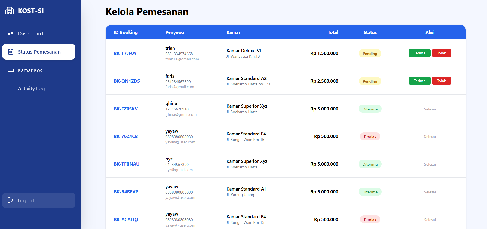
Pada halaman ini admin dapat mengelola seluruh pemesanan pengguna secara terpusat. Data ditampilkan dalam bentuk tabel yang memuat detail penyewa, kamar, total harga, serta status pemesanan. Admin memiliki kontrol penuh untuk menerima atau menolak pemesanan secara langsung. Halaman ini merupakan inti dari pengelolaan operasional pemesanan platform.

---

### **16. Kelola Kamar**

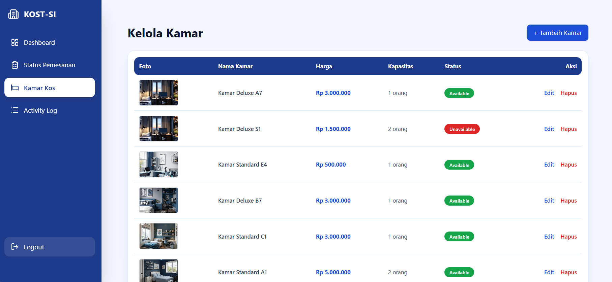
Halaman ini menampilkan seluruh kamar yang terdaftar dalam sistem beserta informasi seperti foto kamar, nama, harga, kapasitas, dan status ketersediaan. Admin dapat melakukan aksi seperti mengedit atau menghapus kamar jika diperlukan. Bagian ini merupakan pusat manajemen data kamar kos yang ada di platform.

---

### **17. Tambah Kamar – Form Bagian 1**


Form bagian pertama ini digunakan admin untuk menambahkan kamar kos baru ke dalam sistem. Data yang harus diisi meliputi nama kamar, harga, kapasitas, status tersedia atau tidak, serta fasilitas lengkap. Struktur form dibuat rapi agar admin dapat memasukkan data dengan akurat tanpa risiko kesalahan.

---

### **18. Tambah Kamar – Form Bagian 2**


Pada bagian kedua form, admin dapat mengunggah gambar kamar serta melihat preview sebelum gambar disimpan. Selain itu, terdapat input tambahan seperti deskripsi kamar atau lokasi. Halaman ini memastikan bahwa kamar yang ditambahkan memiliki informasi lengkap baik secara visual maupun teks.

---

### **19. Activity Log**


Activity Log berfungsi untuk mencatat seluruh aktivitas penting yang dilakukan oleh pengguna maupun admin, seperti login, logout, penambahan data, atau perubahan status pemesanan. Setiap aktivitas dicatat lengkap dengan user ID, waktu kejadian, dan deskripsi tindakan. Fitur ini penting untuk keperluan audit dan keamanan sistem.

---

### **20. Detail Aktivitas**

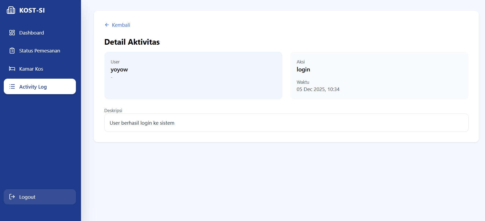
Halaman ini memberikan penjelasan detail terhadap satu aktivitas tertentu dari Activity Log. Informasi yang ditampilkan meliputi nama pengguna, aksi yang dilakukan, waktu aktivitas, serta deskripsi lengkap tindakan tersebut. Halaman ini memudahkan admin melacak dan memahami setiap aktivitas dengan lebih akurat.

---

## Struktur Database


### **Tabel Utama**

* **users** – Data pengguna (admin & user)
* **rooms** – Data kamar kos (harga, fasilitas, status, gambar, lokasi)
* **bookings** – Data pemesanan kamar oleh pengguna
* **activity_logs** – Riwayat aktivitas user & admin (login, booking, CRUD kamar, dll)

### **Relasi Database**

```
users (1) ─── (n) bookings
rooms (1) ─── (n) bookings
users (1) ─── (n) activity_logs
```

---

# ⚙️ Arsitektur & Komponen

### **Arsitektur Aplikasi**

Aplikasi menggunakan arsitektur **MVC (Model–View–Controller)** khas Laravel:

* **Controllers** – Mengelola logika (booking, kamar, dashboard admin, auth)
* **Models** – Struktur tabel database (User, Room, Booking, ActivityLog)
* **Views (Blade)** – Semua halaman frontend (user & admin)
* **Services** –

  * *SupabaseService*: mengelola upload & penyimpanan gambar
  * *ActivityLogger*: mencatat setiap aktivitas user/admin
* **Middleware** – Autentikasi dan proteksi akses admin

---

# ✨ Fitur Teknis Utama

* **Autentikasi** (login & registrasi)
* **Booking kamar real-time**
* **Dashboard admin lengkap** (statistik, grafik, daftar booking terbaru)
* **CRUD kamar kos**
* **Upload gambar ke Supabase Storage**
* **Activity Log otomatis**
* **Responsive UI dengan Tailwind CSS**
* **Vite untuk proses build frontend**

---

# 🧪 Testing

Project sudah mendukung testing dasar Laravel (PHPUnit):

```bash
php artisan test
```

Termasuk:

* Unit test default Laravel
* Feature test dasar

> Project **tidak menggunakan testing kompleks**, jadi bagian ini dibuat sederhana dan sesuai kondisi nyata.

---

# 🚀 Penggunaan

### **Login Pertama Kali**

Setelah setup, login menggunakan akun yang dibuat sendiri (tidak ada seeder default).

### **Alur Penggunaan Sistem**

1. User membuka website dan melihat daftar kamar
2. User melakukan booking
3. Admin mengecek booking pada dashboard
4. Admin menerima atau menolak pemesanan
5. User melihat status pemesanan di halaman **Pesanan Saya**
6. Admin mengelola kamar & memantau aktivitas pengguna

---

# 🛠 Deployment

### **Kebutuhan Server**

* PHP ≥ 8.2
* MySQL
* Composer
* Node.js & NPM
* Web Server (Apache/Nginx)
* Supabase Storage (untuk upload gambar)

### **Optimasi Production**

```bash
php artisan config:cache
php artisan route:cache
php artisan view:cache
composer install --optimize-autoloader --no-dev
```

> Tidak ada cron job & queue worker dalam project kamu, jadi tidak dicantumkan.

---

# 🤝 Kontribusi

1. Fork repository
2. Buat branch baru
3. Commit perubahan
4. Push dan buat Pull Request

---

# 📄 Lisensi

Proyek ini menggunakan lisensi **MIT License**.

---

# ❤️ Credits

* **Laravel Framework**
* **TailwindCSS**
* **Supabase Storage**
* **Vite Build System**

---
