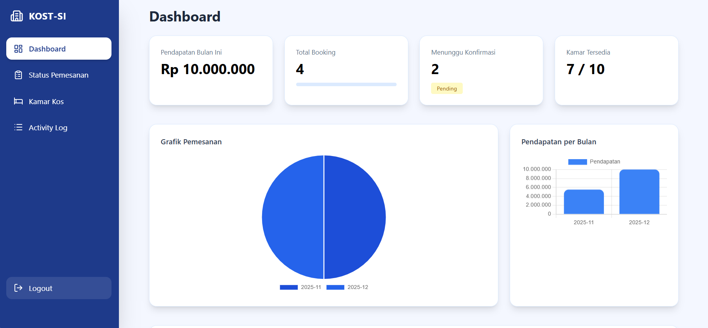

# SI KOST – Sistem Informasi Kost


Sistem Informasi Kost (SI Kost) adalah aplikasi web berbasis Laravel yang digunakan untuk mengelola proses pemesanan dan pengelolaan kamar kost. Aplikasi ini menyediakan fitur untuk pendaftaran pengguna, pemesanan kost, pengecekan status, hingga manajemen data kamar oleh admin. Sistem ini dirancang untuk memberikan pengalaman pemesanan kost yang mudah, cepat, transparan, dan terstruktur.

---

## Daftar Isi

- [SI KOST – Sistem Informasi Kost](#si-kost--sistem-informasi-kost)
  - [Daftar Isi](#daftar-isi)
  - [Fitur Utama](#fitur-utama)
    - [Manajemen Kamar Kost](#manajemen-kamar-kost)
    - [Manajemen Admin](#manajemen-admin)
    - [Fitur Sistem](#fitur-sistem)
  - [Tech Stack](#tech-stack)
    - [Backend](#backend)
    - [Frontend](#frontend)
    - [Libraries](#libraries)
  - [Persyaratan Sistem](#persyaratan-sistem)
    - [Ekstensi PHP](#ekstensi-php)
  - [Instalasi](#instalasi)
    - [1. Clone Repository](#1-clone-repository)
    - [2. Install Dependencies](#2-install-dependencies)
    - [3. Setup Environment](#3-setup-environment)
    - [4. Konfigurasi Database](#4-konfigurasi-database)
    - [5. Migrasi Database](#5-migrasi-database)
    - [6. Setup Storage](#6-setup-storage)
    - [7. Build Asset](#7-build-asset)
    - [8. Jalankan Aplikasi](#8-jalankan-aplikasi)
  - [Konfigurasi](#konfigurasi)
    - [Email Configuration](#email-configuration)
    - [File Storage (Opsional)](#file-storage-opsional)
  - [Role \& Permissions](#role--permissions)
  - [Fitur Berdasarkan Role](#fitur-berdasarkan-role)
    - [User](#user)
    - [Admin](#admin)
  - [Generate PDF](#generate-pdf)
  - [Import Data](#import-data)
  - [Screenshot](#screenshot)
    - [1. Halaman Beranda (Hero Section)](#1-halaman-beranda-hero-section)
    - [2. Fitur Unggulan — Pengalaman Booking](#2-fitur-unggulan--pengalaman-booking)
    - [3. Testimonial Mahasiswa](#3-testimonial-mahasiswa)
    - [4. Tentang KOST-SI](#4-tentang-kost-si)
    - [5. Halaman Kontak](#5-halaman-kontak)
    - [6. Halaman Register](#6-halaman-register)
    - [7. Halaman Login](#7-halaman-login)
    - [8. Halaman Beranda User Setelah Login](#8-halaman-beranda-user-setelah-login)
    - [9. Halaman Pesanan Saya](#9-halaman-pesanan-saya)
    - [10. Dashboard Admin](#10-dashboard-admin)
    - [11. Booking Terbaru (Admin)](#11-booking-terbaru-admin)
    - [12. Kelola Pemesanan](#12-kelola-pemesanan)
    - [13. Activity Log](#13-activity-log)
    - [14. Detail Aktivitas](#14-detail-aktivitas)
    - [15. Tambah Kamar](#15-tambah-kamar)
    - [16. Form Upload Gambar Kamar](#16-form-upload-gambar-kamar)
  - [Struktur Database](#struktur-database)
    - [Tabel Utama](#tabel-utama)
    - [Relasi](#relasi)
  - [Penggunaan](#penggunaan)
  - [Deployment](#deployment)
  - [Kontribusi](#kontribusi)
  - [Lisensi](#lisensi)

---

## Fitur Utama

### Manajemen Kamar Kost  
- ✅ **List Kamar Kost** – Pengguna dapat melihat daftar kamar kost lengkap dengan detail dan statusnya  
- ✅ **Detail Kamar** – Informasi lengkap kamar (foto, fasilitas, harga, lokasi, status)  
- ✅ **Pemesanan Kamar (Booking)** – Pengguna dapat melakukan booking langsung dari website  
- ✅ **Status Pemesanan** – Pengguna dapat melihat apakah pemesanan mereka *pending*, *diterima*, atau *ditolak*  

### Manajemen Admin  
- ✅ **CRUD Kamar Kost** – Admin dapat menambah, memperbarui, dan menghapus kamar  
- ✅ **Upload Foto Kamar** – Admin dapat mengelola gambar kamar  
- ✅ **Dashboard Admin** – Menampilkan statistik kamar dan pemesanan  
- ✅ **Validasi Pemesanan** – Admin dapat menerima atau menolak booking pengguna  
- ✅ **Activity Log** – Melacak aktivitas pengguna dan admin dalam sistem  

### Fitur Sistem  
- ✅ **Authentication** – Login & registrasi untuk user dan admin  
- ❌ **Generate PDF** – *Belum tersedia, direncanakan pada versi berikutnya*  
- ❌ **Import Data Excel** – *Belum tersedia, rencana pengembangan ke depan*  

---

## Tech Stack

### Backend  
- Laravel 12.0  
- Livewire 3.5  
- Spatie Laravel Permission 6.7  
- MySQL  

### Frontend  
- Bootstrap 5  
- Sass  
- Material Design Icons  
- Font Awesome  
- jQuery  
- Alpine.js  

### Libraries  
- Barryvdh DomPDF 3.0 *(belum digunakan)*  
- Maatwebsite Excel 3.1 *(belum digunakan)*  
- Laravel Mix 6  
- Laravel Sanctum  
- Guzzle HTTP  
- Spatie Ignition  
- PHPUnit 11  

---

## Persyaratan Sistem

- PHP ≥ 8.2  
- MySQL ≥ 5.7  
- Composer  
- Node.js & NPM  
- Apache/Nginx  

### Ekstensi PHP  
- OpenSSL  
- PDO  
- Mbstring  
- Tokenizer  
- XML  
- JSON  
- BCMath  
- GD / Imagick  

---

## Instalasi

### 1. Clone Repository  
```bash
git clone https://github.com/yourusername/si-kost.git
cd si-kost
```

### 2. Install Dependencies  
```bash
composer install
npm install
```

### 3. Setup Environment  
```bash
cp .env.example .env
php artisan key:generate
```

### 4. Konfigurasi Database  
```env
DB_DATABASE=si_kost
DB_USERNAME=root
DB_PASSWORD=
```

### 5. Migrasi Database  
```bash
php artisan migrate --seed
```

### 6. Setup Storage  
```bash
php artisan storage:link
```

### 7. Build Asset  
```bash
npm run dev
```

### 8. Jalankan Aplikasi  
```bash
php artisan serve
```

---

## Konfigurasi

### Email Configuration  
```env
MAIL_MAILER=log
QUEUE_CONNECTION=sync
SESSION_DRIVER=file
SESSION_LIFETIME=120
```

### File Storage (Opsional)  
```env
AWS_ACCESS_KEY_ID=your-access-key
AWS_SECRET_ACCESS_KEY=your-secret-key
AWS_BUCKET=your-bucket
```

---

## Role & Permissions

| Role | Deskripsi |
|------|-----------|
| **User** | Melakukan pemesanan kamar kost |
| **Admin** | Mengelola data kamar & booking |

---

## Fitur Berdasarkan Role

### User  
- 📝 Registrasi & Login  
- 🏠 Home setelah login  
- 🏘 Melihat daftar kamar kost  
- 🔍 Melihat detail kamar  
- 🛏 Melakukan booking kamar  
- 📋 Melihat status pemesanan  

### Admin  
- 🔑 Login Admin  
- 📊 Dashboard Admin  
- ➕ Tambah kamar baru  
- ✏ Edit kamar  
- ❌ Hapus kamar  
- 🖼 Upload foto kamar  
- 🔄 Ubah status kamar (Available / Booked)  
- 📄 Memproses booking pengguna  
- 📜 Activity log  

---

## Generate PDF  
Fitur pembuatan PDF **belum tersedia** dalam aplikasi SI Kost.  

---

## Import Data  
Fitur import data Excel **belum tersedia**.  

---

## Screenshot  

### 1. Halaman Beranda (Hero Section)

*Tampilan utama ketika pengguna membuka website, menampilkan slogan, CTA, dan statistik kamar.*

### 2. Fitur Unggulan — Pengalaman Booking

*Menjelaskan tiga fitur utama: proses mudah, keamanan, dan harga transparan.*

### 3. Testimonial Mahasiswa

*Berisi pendapat nyata dari mahasiswa ITK terhadap platform KOST-SI.*

### 4. Tentang KOST-SI

*Penjelasan lengkap mengenai platform beserta slider foto kamar.*

### 5. Halaman Kontak

*Menampilkan info kontak resmi: telepon, email, dan lokasi kampus ITK.*

### 6. Halaman Register

*Form pendaftaran pengguna baru dengan tampilan modern dan clean.*

### 7. Halaman Login

*Tampilan login bagi pengguna untuk masuk ke sistem.*

### 8. Halaman Beranda User Setelah Login

*User dapat langsung mengakses fitur pemesanan kamar setelah login.*

### 9. Halaman Pesanan Saya

*Menampilkan daftar riwayat pemesanan user, lengkap dengan status pemesanan.*

### 10. Dashboard Admin

*Admin dapat melihat grafik pemesanan, pendapatan bulanan, dan statistik jumlah kamar.*

### 11. Booking Terbaru (Admin)

*Admin melihat daftar pemesanan terbaru lengkap dengan statusnya.*

### 12. Kelola Pemesanan

*Admin dapat menerima atau menolak pemesanan pengguna secara langsung.*

### 13. Activity Log

*Fitur pencatatan riwayat aktivitas user seperti login, logout, dan tindakan lainnya.*

### 14. Detail Aktivitas

*Halaman detail untuk melihat aktivitas spesifik yang dilakukan pengguna.*

### 15. Tambah Kamar

*Form bagi admin untuk menambah data kamar baru ke sistem.*

### 16. Form Upload Gambar Kamar

*Admin dapat mengunggah dan mem-preview gambar kamar sebelum disimpan.*


---

## Struktur Database

### Tabel Utama  
- users  
- rooms  
- bookings  
- activity_logs  

### Relasi  
```
users (1) ─── (n) bookings  
rooms (1) ─── (n) bookings  
users (1) ─── (n) activity_logs  
```

---

## Penggunaan

1. User melakukan registrasi  
2. User login  
3. User memilih kamar kost  
4. User melakukan booking  
5. Admin memverifikasi booking  
6. User memantau status pemesanan  
7. Admin mengelola kamar & aktivitas  

---

## Deployment

```bash
php artisan config:cache
php artisan route:cache
php artisan view:cache
composer install --optimize-autoloader --no-dev
```

---

## Kontribusi  
1. Fork repository  
2. Buat branch fitur  
3. Commit perubahan  
4. Push ke branch  
5. Pull Request  

---

## Lisensi  
Project ini menggunakan **MIT License**.
