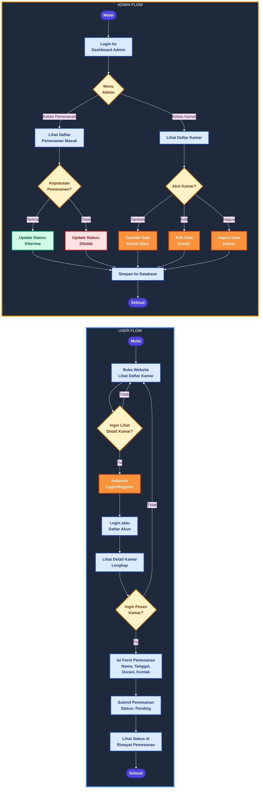
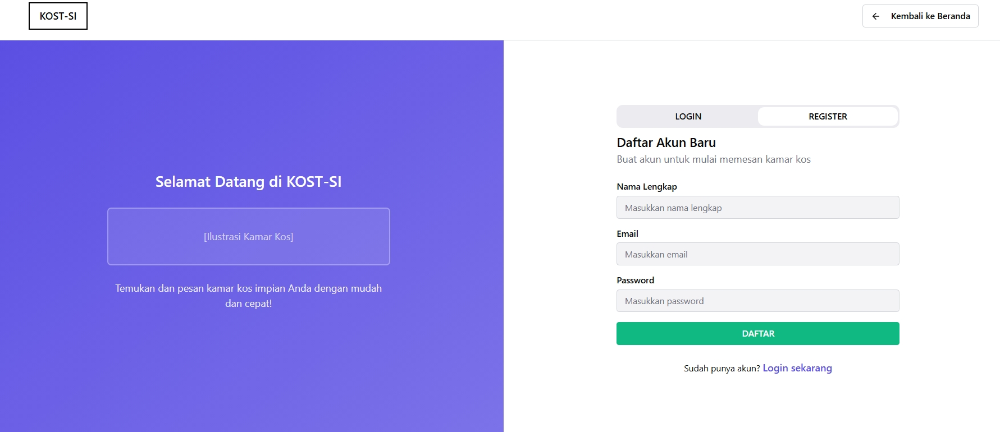
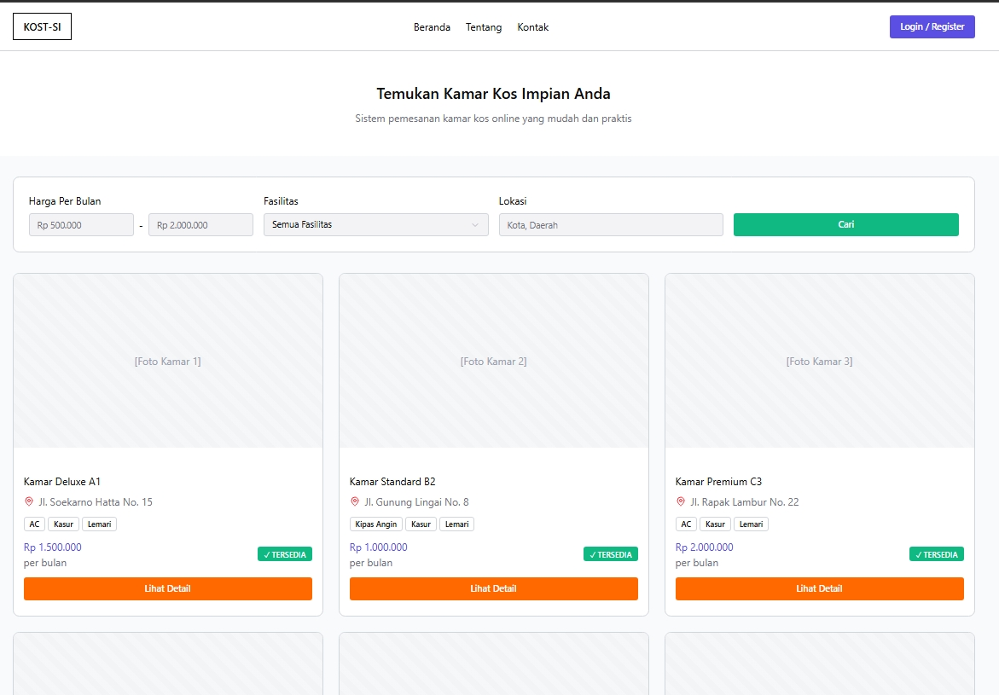
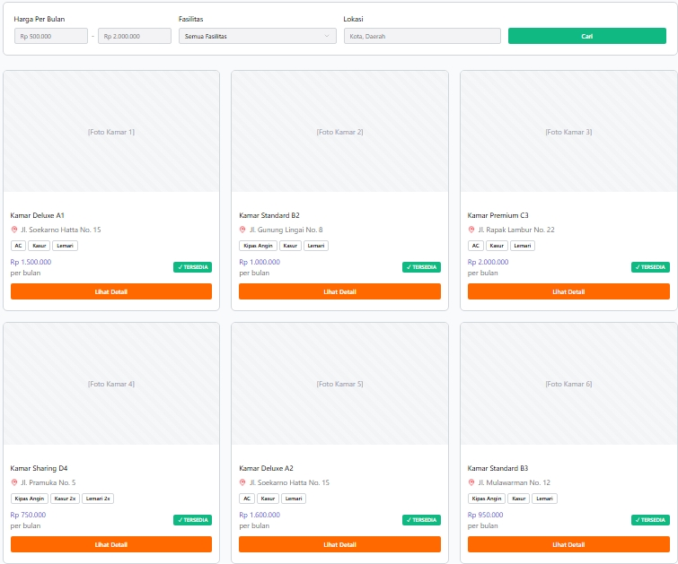
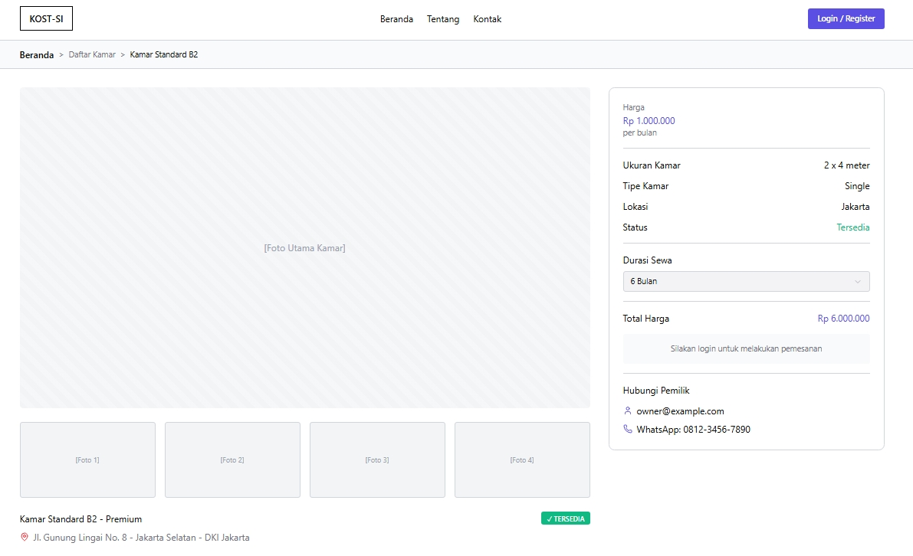
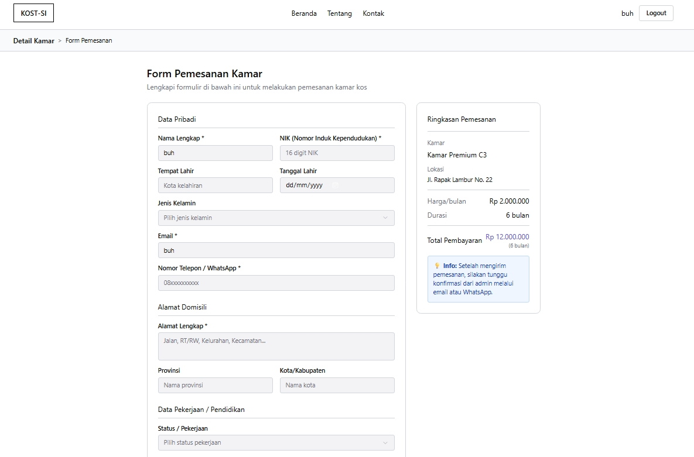
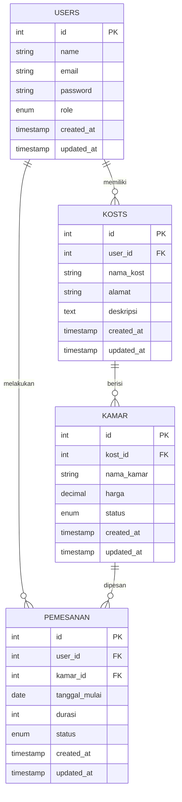

# FINAL PROJECT CLOUD COMPUTING
## Progress I → Branch [Fitur x]

### Identitas
- Kelompok : 3 (AllToWell)
- Kelas    : B  
- Nama     : 
  - Tri Wahyuni (10221032) 
  - Elifas Lolo Padang (10221024)
  - Faradila Zakiah Nur Hafitsa (120221066)
  - Nadya Alivia Raaph (10221086)

--- 
# ✅ DELIVERABLES

Document Proposal (PDF/Markdown) berisi:

## Deskripsi aplikasi

Aplikasi web berbasis Laravel yang dirancang untuk mempermudah proses reservasi dan pemesanan kamar kos secara online bagi mahasiswa. Sistem ini menyediakan platform digital yang memungkinkan pengguna untuk melihat daftar kamar kos, melihat detail fasilitas, serta melakukan pemesanan dengan cepat tanpa perlu datang langsung ke lokasi.
Aplikasi ini memiliki dua jenis peran pengguna, yaitu Admin memiliki hak akses untuk mengelola seluruh data kamar kos, mengonfirmasi pemesanan, serta memantau aktivitas pengguna melalui dashboard. Admin juga dapat memperbarui status pemesanan menjadi Pending, Diterima, atau Ditolak. Dan User (mahasiswa) dapat melakukan registrasi dan login ke sistem untuk melihat daftar kamar, membaca detail kamar, mengisi form pemesanan, serta memantau status pemesanan mereka. Dengan fitur-fitur yang sederhana namun fungsional, KOST-SI diharapkan dapat membantu mahasiswa terutama mahasiswa baru dan aktif di sekitar Institut Teknologi Kalimantan (ITK) untuk menemukan dan memesan kamar kos dengan cara yang lebih mudah, cepat, dan transparan. Sistem ini juga membantu pemilik kos (melalui admin) dalam mengelola data kamar serta memantau pemesanan secara efisien melalui antarmuka berbasis web.

---

## Target user
Adapun target sistem yang akan dibangun yaitu : 
### 1. Mahasiswa aktif
  
  Mahasiswa aktif adalah pengguna yang sudah berkuliah dan sedang menempuh studi di ITK, yaitu:
  - Mungkin ingin pindah kos karena alasan kenyamanan, biaya, atau lokasi yang lebih dekat ke kampus.
  - Membutuhkan akses cepat dan fleksibel untuk mencari informasi kamar kos tanpa harus survey langsung.
  - Dapat menggunakan aplikasi untuk melihat ketersediaan kamar, membandingkan harga dan fasilitas, serta melakukan pemesanan langsung secara online.
  - Dengan adanya fitur riwayat pemesanan, mereka bisa melacak status pemesanan dan histori kos sebelumnya dengan mudah.
  
### 2. Mahasiswa baru yang berdomisili luar balikpapan
  
  Mahasiswa baru (maba) yang berasal dari luar daerah merupakan kelompok utama yang paling diuntungkan dari sistem ini, yaitu:
  - Umumnya belum mengenal wilayah Balikpapan terutama daerah sekitar ITK, sehingga kesulitan mencari kos secara langsung.
  - Dapat memanfaatkan sistem untuk melihat daftar kos lengkap dengan foto, harga, dan fasilitas, bahkan sebelum tiba di Balikpapan.
  - Dengan fitur form pemesanan online, mereka bisa memesan kamar lebih awal untuk memastikan tempat tinggal tersedia sebelum masa perkuliahan dimulai.
  - Proses pemesanan dan konfirmasi yang dilakukan secara digital dan transparan membantu mereka menghindari penipuan atau kesalahan informasi dari pihak ketiga.

### 3. Masyarakat umum
  
  Selain mahasiswa, sistem ini juga relevan bagi masyarakat umum yang mencari tempat tinggal sementara di Balikpapan/daerah sekitar ITK seperti pekerja, pegawai proyek, atau perantau.
  - Mencari kos yang strategis dan sesuai kebutuhan jangka pendek/panjang.
  - Menginginkan proses pemesanan yang fleksibel dan cepat tanpa kontak langsung dengan pemilik kos.
  - Butuh informasi yang terpercaya dan diperbarui secara berkala mengenai ketersediaan kamar.

---

## Fitur-Fitur Utama (minimal 4 fitur)

### 1. CRUD Data Kamar Kos
Fitur ini memungkinkan pemilik kos atau admin untuk mengelola seluruh data kamar kost secara dinamis. Melalui fitur ini, pemilik dapat menambahkan kamar baru dengan informasi lengkap seperti nama kamar, harga sewa, fasilitas, kapasitas, dan foto pendukung. Selain itu, pemilik juga dapat melihat daftar kamar yang telah terdaftar, memperbarui informasi kamar jika ada perubahan (misalnya harga atau status ketersediaan), dan menghapus kamar jika sudah tidak tersedia. 

### 2. Tampilan Daftar Kamar
Fitur ini menampilkan daftar seluruh kamar kos yang tersedia dalam bentuk tampilan yang rapi dan mudah dipahami oleh pengguna. Setiap kamar ditampilkan dalam bentuk kartu atau daftar yang berisi foto, nama kamar, harga, fasilitas utama, serta status ketersediaan. Pengguna juga dapat melakukan pencarian dan penyaringan (filter) berdasarkan harga, fasilitas, atau lokasi sehingga proses menemukan kamar sesuai kebutuhan menjadi lebih cepat dan efisien. Tampilan daftar kamar ini berfungsi sebagai halaman utama bagi mahasiswa untuk melakukan eksplorasi kos yang cocok sebelum melanjutkan ke proses pemesanan.

### 3. Form Pemesanan Kamar
Fitur form pemesanan kamar digunakan oleh user untuk melakukan proses pemesanan kamar kos secara online. Setelah memilih kamar yang diinginkan, pengguna akan diarahkan ke halaman formulir yang berisi data diri, tanggal mulai sewa, lama kontrak, serta metode pembayaran. Pengguna juga dapat mengunggah bukti pembayaran jika diperlukan. Informasi yang dikirim melalui form ini akan tersimpan di sistem dan diteruskan ke pemilik kos untuk proses verifikasi. Dengan fitur ini, mahasiswa tidak perlu datang langsung ke lokasi untuk melakukan reservasi, sehingga proses menjadi lebih praktis dan cepat.

### 4. Status Pemesanan 
Fitur status pemesanan memungkinkan pengguna untuk melacak perkembangan pesanan kamar mereka secara real-time. Setiap pemesanan akan memiliki status tertentu, seperti pending (menunggu konfirmasi), confirmed (dikonfirmasi), rejected (ditolak), cancelled (dibatalkan), atau completed (selesai). Pengguna dapat melihat status ini melalui dashboard akun mereka dan mendapatkan notifikasi apabila ada perubahan status. Dengan adanya fitur ini, proses komunikasi antara pemilik kos dan penyewa menjadi lebih transparan, dan pengguna dapat merasa lebih aman serta terjamin dalam melakukan pemesanan kamar kos.

## User Flow Diagram

Admin Flow dan User Flow 

Penjelasan :
#### 1. Admin Flow (Alur Admin)

Admin Flow menggambarkan aktivitas yang dilakukan oleh pihak pengelola (admin) dalam sistem KOST-SI.

Admin berperan penting dalam memverifikasi pesanan pengguna serta mengelola data kamar kos yang tersedia.

Penjelasan Alur:

1. Mulai
   
   Admin mengakses sistem dengan membuka halaman dashboard admin.

2. Login ke Dashboard
   
   Admin melakukan login menggunakan akun yang memiliki hak akses untuk mengelola sistem.

3. Menu Admin
   
   Setelah berhasil login, admin memiliki dua menu utama:
   
   a. Kelola Pemesanan
   
   Admin dapat melihat daftar pemesanan baru yang masuk dari pengguna.
   Pada tahap ini, admin mengambil keputusan terhadap pemesanan, apakah diterima atau ditolak.
   - Jika diterima, maka status pesanan berubah menjadi “Diterima”.
   - Jika ditolak, maka status pesanan berubah menjadi “Ditolak”.
    
    Semua perubahan ini kemudian disimpan ke dalam database.

   b. Kelola Kamar
   
   Selain pemesanan, admin juga dapat mengelola data kamar kos, termasuk menambah, mengedit, atau menghapus data kamar sesuai kebutuhan.

4. Simpan ke Database
   
   Setiap perubahan baik pada data pemesanan maupun data kamar akan disimpan ke database sistem.

5. Selesai
   
   Setelah semua data tersimpan, proses kerja admin dianggap selesai.

#### 2. User Flow (Alur Pengguna)

User Flow menjelaskan alur aktivitas yang dilakukan oleh pengguna umum (penyewa kos) ketika menggunakan sistem KOST-SI (Sistem Pemesanan Kamar Kos Online).

Alur ini menunjukkan langkah-langkah mulai dari pengguna membuka website hingga proses pemesanan kamar selesai.

Penjelasan Alur:

1. Mulai
   
   Pengguna memulai dengan membuka website KOST-SI.

2. Melihat Daftar Kamar Kos
   
   Setelah masuk ke halaman utama, pengguna dapat melihat daftar kamar kos yang tersedia beserta informasi singkat seperti harga, lokasi, dan fasilitas utama.

3. Melihat Detail Kamar
   
   Pengguna memiliki opsi untuk melihat detail kamar secara lebih lengkap. Jika tidak ingin melihat, pengguna tetap berada di halaman daftar kamar. Jika iya, maka sistem akan mengarahkan pengguna ke halaman login atau registrasi.

4. Login atau Registrasi Akun
   
   Pengguna harus login terlebih dahulu. Jika belum memiliki akun, maka perlu melakukan pendaftaran untuk dapat melanjutkan ke tahap pemesanan.

5. Melihat Detail Kamar Lengkap
   
   Setelah login, pengguna bisa melihat informasi kamar secara rinci seperti fasilitas, foto, harga, dan deskripsi.

6. Melakukan Pemesanan Kamar
   
   Jika pengguna tertarik, maka dapat mengisi formulir pemesanan yang berisi nama, tanggal mulai sewa, durasi, serta kontak.

7. Submit Pemesanan
   
   Setelah formulir dikirim, sistem akan menyimpan data pemesanan tersebut dengan status awal “Pending” (menunggu verifikasi admin).

8. Melihat Status Pemesanan
   
   Pengguna dapat memantau status pesanan melalui halaman riwayat pemesanan.

9. Selesai
    
    Proses pemesanan dianggap selesai setelah data berhasil disimpan dan pengguna menunggu verifikasi dari pihak admin.

---
## Wireframe/Mockup (low-fidelity)

Minimal 4 Page utama 
Bisa menggunakan: Figma, Draw.io, atau sketsa manual (difoto) 

#### Gambar Mockup Login dan Register
Screenshot:

#### Gambar Mockup Halaman Beranda
Screenshot:

#### Gambar Mockup Halaman Daftar Kamar
Screenshot:

#### Gambar Mockup Halaman Detail Kamar
Screenshot:

#### Gambar Mockup Halaman Form Pemesanan
Screenshot:

---

## Database Schema Design

### 1. Daftar Tabel yang Dibutuhkan

| No | Nama Tabel    | Deskripsi                                                      |
| -- | ------------- | -------------------------------------------------------------- |
| 1  | **users**     | Menyimpan data akun pengguna (admin dan user).                 |
| 2  | **kosts**     | Menyimpan data informasi kos yang dikelola oleh admin/pemilik. |
| 3  | **kamar**     | Menyimpan detail setiap kamar kos, termasuk harga dan status.  |
| 4  | **pemesanan** | Menyimpan data pemesanan kamar oleh pengguna.                  |

---

## **2. Relasi Antar Tabel**

* **users → pemesanan** : *1–N* → Satu pengguna dapat melakukan banyak pemesanan.
* **kosts → kamar** : *1–N* → Satu kos memiliki banyak kamar.
* **kamar → pemesanan** : *1–N* → Satu kamar bisa dipesan beberapa kali (di waktu berbeda).
* **users (admin) → kosts** : *1–N* → Satu admin/pemilik dapat memiliki beberapa kos.

---

## **3. Struktur dan Field Tabel**

### **Tabel: users**

| Field      | Tipe Data            | Keterangan             |
| ---------- | -------------------- | ---------------------- |
| id         | int (PK)             | ID unik pengguna       |
| name       | string               | Nama pengguna          |
| email      | string               | Email unik             |
| password   | string               | Kata sandi terenkripsi |
| role       | enum('admin','user') | Peran pengguna         |
| created_at | timestamp            | Tanggal dibuat         |
| updated_at | timestamp            | Tanggal diperbarui     |

---

### **Tabel: kosts**

| Field      | Tipe Data           | Keterangan         |
| ---------- | ------------------- | ------------------ |
| id         | int (PK)            | ID unik kos        |
| user_id    | int (FK → users.id) | Pemilik kos        |
| nama_kost  | string              | Nama kos           |
| alamat     | string              | Alamat lengkap kos |
| deskripsi  | text                | Deskripsi kos      |
| created_at | timestamp           | Tanggal dibuat     |
| updated_at | timestamp           | Tanggal diperbarui |

---

### **Tabel: kamar**

| Field      | Tipe Data                  | Keterangan                |
| ---------- | -------------------------- | ------------------------- |
| id         | int (PK)                   | ID unik kamar             |
| kost_id    | int (FK → kosts.id)        | Kos tempat kamar berada   |
| nama_kamar | string                     | Nama atau nomor kamar     |
| harga      | decimal                    | Harga sewa per bulan      |
| status     | enum('tersedia','dipesan') | Status ketersediaan kamar |
| created_at | timestamp                  | Tanggal dibuat            |
| updated_at | timestamp                  | Tanggal diperbarui        |

---

### **Tabel: pemesanan**

| Field         | Tipe Data                                   | Keterangan              |
| ------------- | ------------------------------------------- | ----------------------- |
| id            | int (PK)                                    | ID unik pemesanan       |
| user_id       | int (FK → users.id)                         | Pengguna yang memesan   |
| kamar_id      | int (FK → kamar.id)                         | Kamar yang dipesan      |
| tanggal_mulai | date                                        | Tanggal mulai sewa      |
| durasi        | int                                         | Lama sewa (dalam bulan) |
| status        | enum('pending','dibayar','selesai','batal') | Status pemesanan        |
| created_at    | timestamp                                   | Tanggal dibuat          |
| updated_at    | timestamp                                   | Tanggal diperbarui      |

---

## **4. Diagram Relasi Antar Tabel (ERD)**

---

## **5. Penjelasan Singkat**

Desain database ini disusun agar sistem **KOST-SI** dapat:

* Mengelola akun admin dan user secara terpisah.
* Memungkinkan satu admin memiliki banyak kos dan kamar.
* Menyimpan riwayat pemesanan oleh user dengan status yang jelas (pending, dibayar, selesai, atau batal).
* Memastikan integritas data melalui relasi antar tabel (Foreign Key).

